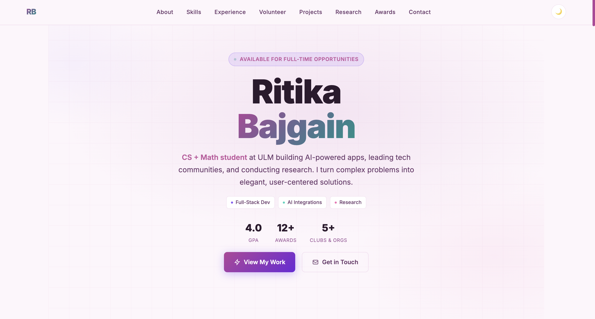

# 🌸 Ritika Bajgain - Personal Portfolio

A personal portfolio website showcasing my journey as a Computer Science student at the University of Louisiana Monroe.

## ✨ Features

- Light / Dark mode toggle
- Smooth scroll animations powered by AOS
- Fully responsive, mobile-friendly navigation
- **Sections:** About, Skills, Experience, Volunteer, Projects, Research, Awards, Campus Involvement, Contact

## 🛠️ Built With

- HTML5, CSS3, JavaScript
- AOS - Animate On Scroll
- Google Fonts - Inter & Fira Code

## 📁 Structure

```
Portfolio/
├── index.html # Main page
├── styles.css # All styling & themes
├── script.js # Interactivity & nav logic
├── images/ # Project & org logos
└── documents/ # Resume & Cover Letter (PDF)
```


